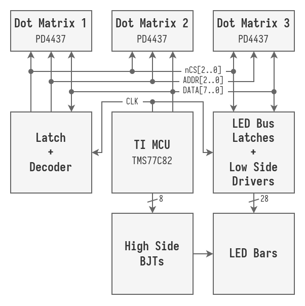

# Teufenzeiger
This project was an interesting dive into old-fashioned electronics design. I had a lot of fun reverse engineering this device and now have a slightly too large weather station in my room.

## Introduction

While broswing a local electronics market in my hometown, I found a strange rectangular device with many LEDs, dot matrix displays and some label on the front. The label said things like "9. Sohle" (9th level) or "Rasenhängebank" (shaft station). On the back was a sticker with "Siemens Teufenzeiger" (mining depth indicator). I realized that this is some old mining gear back from the "coal age" of the Ruhr Area and was hooked immediately.

After some research I discovered that this device is from the [Zeche Lerche](https://de.wikipedia.org/wiki/Schacht_Lerche). Zeche Lerche was a coal mine at the edge of the ruhr area, that closed down in 2010. The device was used to display the current depth of the cage in the mine shaft. The device in operation can be seen <a href="https://www.youtube.com/watch?v=-LQ7gyPmhy4&t=261s" target="_blank">here</a>.

When I powered the device up using a 12 V brick, the matrix display only displayed "ERROR". Then I decided to open up the device.

## Reverse Engineering
When opening up the device I discovered a huge PCB, littered with 7400-series ICs and a TI TMS77C82NL microcontroller. After some research, I ditched the idea of dumping the firmware of the microcontroller because there is absolutely no information about the microcontroller on the internet. As a first goal I wanted to write some text to the dot matrix displays. So I had to do some hardware reverse engineering.

On the back of the device was another label that stated some serial baud rates. So I hoped that the devices uses a standard RS-485 communication, which is pretty common for industrial equiment here in Germany.

But upon closer inspection of the PCB, I discovered that an isolated current loop communication based on the HCPL-4100 & HCPL-4200 was used. This lead me to reverse engineer the whole device. Reverse engineering was done using a multimeter in continuity mode, in combination with many datasheets.

### Communication
Since the device was build around a microcontroller from the 80s, an 8-bit parallel bus is used to interface with all components. This 8-bit parallel bus selects behaves as a "chip select" signal, as well as a data line for writing data to all components. Other signals like address signals or nCS signals are generated via multiple latches, controlled by the MCU. The general architecture of the device is depicted below.

